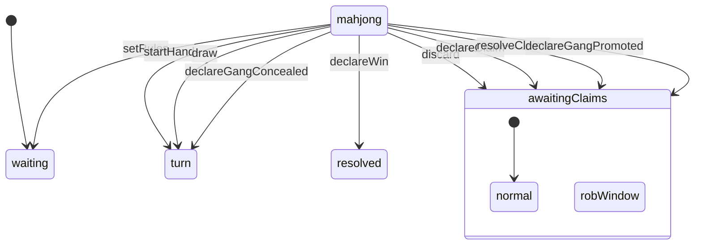

# Engine state diagram

```mermaid
stateDiagram-v2
    [*] --> waiting
    waiting
    turn
    state awaitingClaims {
        [*] --> normal
        normal
        robWindow
    }
    resolved
    mahjong --> waiting: setRules
    mahjong --> turn: startHand
    mahjong --> turn: draw
    mahjong --> awaitingClaims: discard
    mahjong --> awaitingClaims: declareClaim
    mahjong --> awaitingClaims: resolveClaims
    mahjong --> turn: declareGangConcealed
    mahjong --> awaitingClaims: declareGangPromoted
    mahjong --> resolved: declareWin
```

_Generated by `pnpm --filter @mahjong/game-logic diagram`._
